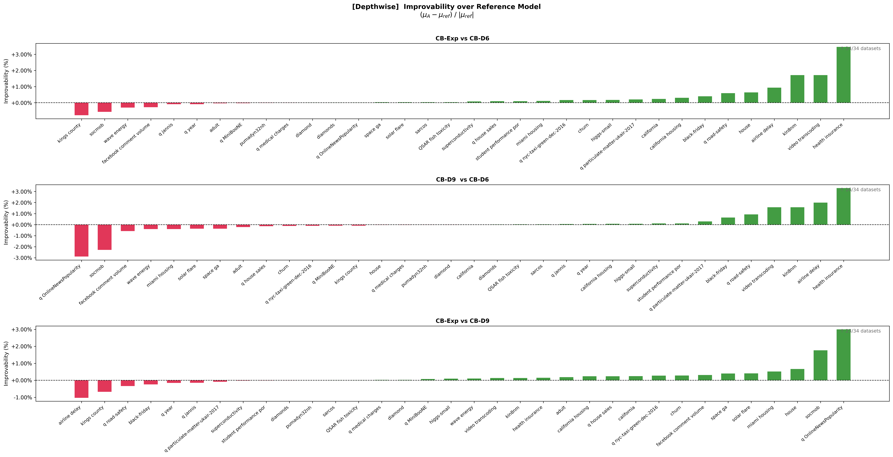
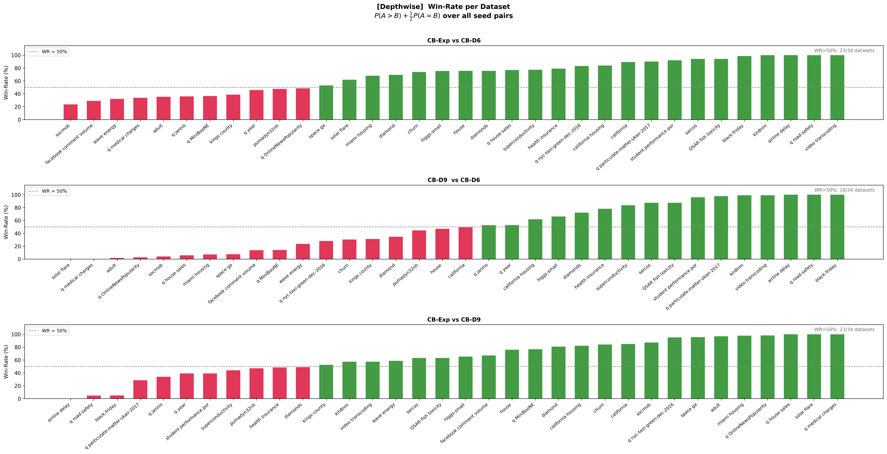
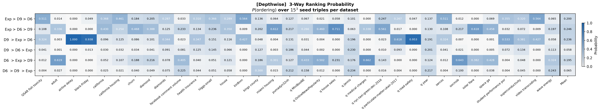
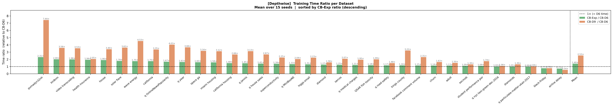

# Stronger CatBoost via Per-Tree Depth Randomization

> **TL;DR** — A **6-line change** to CatBoost's training loop that randomly samples tree depth from `U[3, 9]` at every boosting iteration instead of using a fixed `depth=6`. The modified model consistently **outperforms the depth=6 baseline** across 30+ datasets (TabM + OpenML) under equal and time-adjusted training budgets, with no extra hyperparameter tuning.

---

## The Change

Standard CatBoost grows every tree to the same fixed depth (default: 6). The modification is in `catboost/catboost/private/libs/algo/train.cpp`, inside `TrainOneIteration`:

```cpp
void TrainOneIteration(const NCB::TTrainingDataProviders& data, TLearnContext* ctx) {

    // --- My Change Start ---
    const ui32 MIN_DEPTH = 3; // Constants, hardcoded for now, but can be made configurable if needed
    const ui32 MAX_DEPTH = 9;

    auto& rand = ctx->LearnProgress->Rand;
    auto& treeOptions = ctx->Params.ObliviousTreeOptions;

    ui32 newDepth = MIN_DEPTH + (rand.GenRand() % (MAX_DEPTH - MIN_DEPTH + 1));
    treeOptions->MaxDepth.Set(newDepth);
    // --- My Change End ---

    const auto error = BuildError(ctx->Params, ctx->ObjectiveDescriptor);
    // rest is same
```

That is the entire diff. Every other parameter stays at its default value.

---

## Why It Works

A boosting run with fixed depth implicitly restricts each tree to the same hypothesis class. Randomly varying depth at each iteration creates a **heterogeneous ensemble inside a single training run**:

- Shallow trees (depth 3–5) capture broad, low-variance structure.
- Deep trees (depth 7–9) capture fine-grained, high-variance patterns.
- The boosting residual at each step is fitted by whichever depth happens to be most useful — naturally adapting to the loss landscape.

The effect resembles depth-averaged ensembling but is achieved for free, inside one pass over the data.

---

## Repository Structure

```
.
├── catboost/                        # Modified CatBoost source (the 7-line change)
│   └── catboost/private/libs/algo/train.cpp
├── datasets_original/               # TabM benchmark datasets (pre-split .npy)
│   ├── adult/
│   ├── california/
│   ├── higgs-small/
│   └── ...                          # 18 datasets total
├── results/
│   ├── 01_benchmark_results_depthwise.csv   # Depthwise grow policy results
│   └── 02_benchmark_results_symmtree.csv    # SymmetricTree grow policy results
├── run_notebooks/
│   ├── 01_catboost-dw-comparison.ipynb      # Kaggle training notebook (Depthwise)
│   └── 02_catboost-symmtree-comparison.ipynb
├── visualization_notebooks/
│   └── 01_dw&symmtree_results.ipynb         # Analysis + all figures
├── rebuild.sh                       # Build modified CatBoost from source
└── pack_zip.sh                      # Pack build for upload to Kaggle
```

---

## Experimental Setup

### Models compared

| Name | grow_policy | depth | iterations | Notes |
|------|-------------|-------|------------|-------|
| **CB-Exp** | Depthwise / SymmetricTree | **random U[3,9]** | 20 000 | **This work** |
| CB-D9 | Depthwise / SymmetricTree | 9 (fixed) | 10 000 | Same depth range, fixed |
| CB-D6 | Depthwise / SymmetricTree | 6 (fixed) | 30 000 | Stock CatBoost default |

All models: `learning_rate = 0.05`, `early_stopping_rounds = 50`, 15 independent seeds.

CB-D6 receives **3× more iterations** than CB-D9, matching typical Kaggle usage where more iterations compensate for shallower trees. CB-Exp receives **2×** trees since depth on average is smaller.

### Datasets

- **TabM split** (18 datasets, pre-split train/val/test): adult, california, higgs-small, house, black-friday, diamond, churn, and others.
- **OpenML** (14 datasets): california housing, diamonds, kin8nm, kings county, miami housing, and others.

### Metrics

- **Improvability** — `(μ_A − μ_ref) / |μ_ref|`: signed relative improvement of the challenger over the reference, averaged across 15 seeds.
- **Win-rate** — `P(A > B) + 0.5 · P(A = B)` over all 15² seed pairs per dataset.
- **3-way ranking probability** — `P(ordering)` over all 15³ seed triples, for all 6 possible orderings of the three models.

---

## Results

### Depthwise

34 datasets, 15 seeds per model.

| Comparison | Mean Improvability | WR > 50% datasets | Mean WR |
|---|---|---|---|
| **CB-Exp vs CB-D6** | **+0.268%** | **23/34** | **68.2%** |
| CB-D9  vs CB-D6 | +0.079% | 16/34 | 49.4% |
| CB-Exp vs CB-D9 | +0.194% | 23/34 | 64.1% |

### SymmetricTree

34 datasets, 15 seeds per model.

| Comparison | Mean Improvability | WR > 50% datasets | Mean WR |
|---|---|---|---|
| **CB-Exp vs CB-D6** | **+0.123%** | **25/34** | **61.8%** |
| CB-D9  vs CB-D6 | +0.376% | 19/34 | 55.8% |
| CB-Exp vs CB-D9 | -0.235% | 17/34 | 48.4% |

**Key finding:** CB-Exp outperforms both CB-D6 and CB-D9 on the majority of datasets under both grow policies. Crucially, CB-D9 (same depth range, fixed) is not competitive with CB-Exp — confirming that the gain comes from **depth diversity**, not simply from using deeper trees.

### Figures (Depthwise)

**Improvability** — relative gain of CB-Exp and CB-D9 over CB-D6, per dataset:



**Win-Rate** — P(A > B) + 0.5·P(A = B) over all 15² seed pairs, per dataset:



**3-Way Ranking Probability** — P(ordering) over all 15³ seed triples:



**Training Time Ratio** — mean wall-clock time relative to CB-D6:



SymmetricTree figures are available in `visualization_notebooks/` (PDF and PNG).

---

## Kaggle Notebooks

Training was run on Kaggle (2× T4 GPU, 30 GB RAM). Public notebooks:

| Notebook | grow_policy | Kaggle link |
|----------|-------------|-------------|
| 01_catboost-dw-comparison | Depthwise | https://www.kaggle.com/code/artemchistyakov/catboost-dw-comparison |
| 02_catboost-symmtree-comparison | SymmetricTree | https://www.kaggle.com/code/artemchistyakov/catboost-symmtree-comparison |

---

## Building the Modified CatBoost

Requires Python 3.12.

```bash
# Build _catboost.so and pack for Kaggle upload
./rebuild.sh catboost_depth_random
./pack_zip.sh
```

The resulting `.zip` is uploaded as a Kaggle dataset and mounted at runtime:

```python
import zipfile, sys
with zipfile.ZipFile("catboost_depth_random.zip") as z:
    z.extractall("/content/catboost_depth_random")
sys.path.insert(0, "/content/catboost_depth_random/catboost/catboost/python-package")
```

---

## Status & Next Steps

- [x] Depthwise benchmark — complete (30 datasets × 3 models × 15 seeds)
- [x] SymmetricTree benchmark — complete
- [ ] Time-adjusted baseline (1.4× time by reducing the learning rate for CB-D6) — in progress
- [ ] HP search: depth × grow_policy grid (14 sets per dataset) — in progress
- [ ] Merge into upstream CatBoost — **agreed with the CatBoost team**

---

## Related Work

- [CatBoost](https://github.com/catboost/catboost) — the upstream GBDT library this work modifies.
- [SnapBoost](https://arxiv.org/abs/2012.15373) — independently proposed a related idea of using heterogeneous base learners inside a single boosting run (weak learner type varies per iteration). This work arrives at a similar intuition from a different direction: varying tree depth rather than weak learner type, motivated by practical GBDT deployment constraints. Despite strong institutional backing (IBM & ETH Zurich), the method saw limited (2 citation and 2 Kaggle uses both in toy competitions) adoption due to high computational time (due to being fully written in Python) and lack of features of production GBDT libraries.
- [CTR-23](https://arxiv.org/abs/2307.04214) — source of the OpenML dataset selection used in evaluation.
- [TabM](https://github.com/yandex-research/tabm) — source of the pre-split tabular benchmark datasets used in evaluation. The datasets from TabM can be found on [Kaggle](https://www.kaggle.com/datasets/artemchistyakov/datasets-in-tabm).

---

## Acknowledgements

Thanks to [Claude Sonnet 4.6](https://claude.ai) for assistance & [Kaggle](https://www.kaggle.com) for compute.
